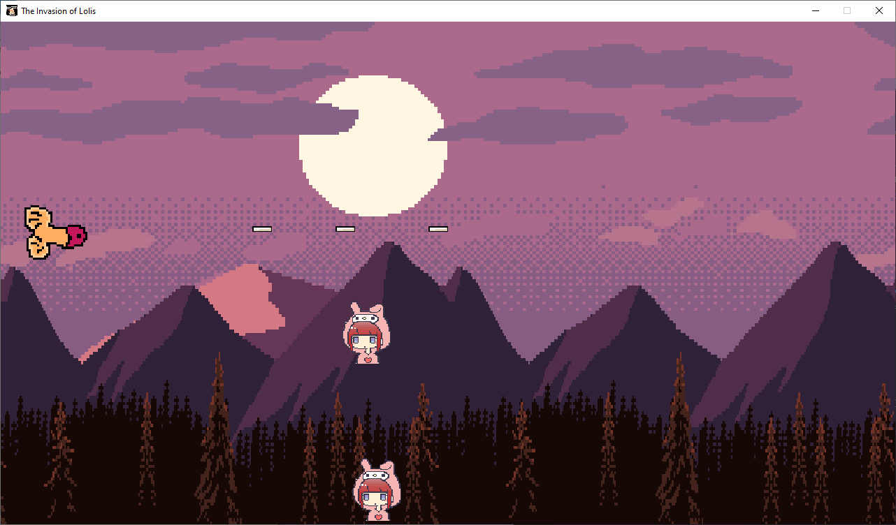

# The Invasion of Lolis
The Invasion of Lolis, is a 2d spaceship game created with the goal of entertainment for Otaku group.
<br>


## Usage
Basically you control a space ship, you are initially in Otakolândia, and your main objective is to survive Lolis's invasion from Lolilândia.

## Installation
Use the package manager [pip](https://pip.pypa.io/en/stable/) to install pygame.

```bash
pip install pygame
```

## Contributing
Pull requests are welcome. For major changes, please open an issue first to discuss what you would like to change.

Please make sure to update tests as appropriate.

## License
[MIT](https://choosealicense.com/licenses/mit/)
